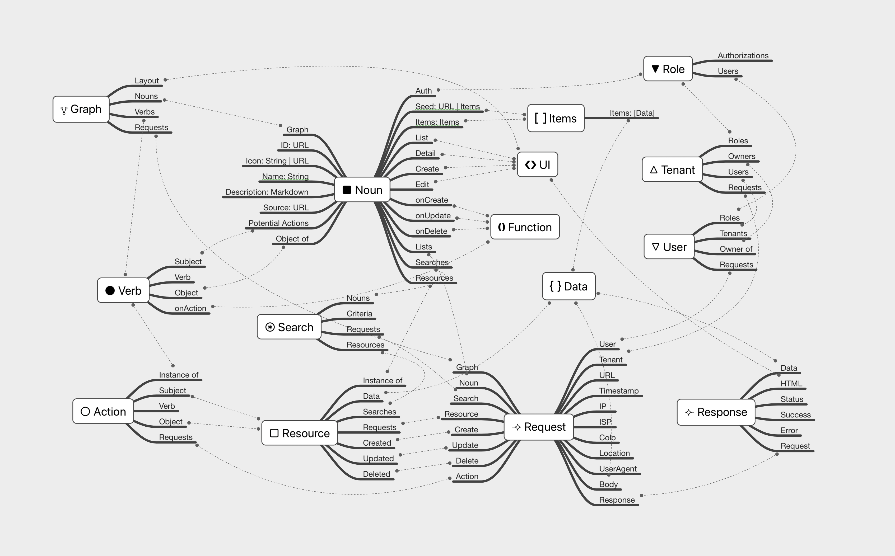

# GraphDL - Graph Definition Language

GraphDL is a graph-based data language for describing data models and data relationships.

```yaml
User:
 _id:   email
 _name: ${name} <${email}>
 _icon: 🧑
 _sameAs: https://schema.org/Person
 name:  name
 email: email
 image: url
 posts: [Post.author]
 
Post:
 _id:         slugify(Title)
 _name:       title
 _icon:       📋
 _sameAs:     https://schema.org/BlogPosting
 title:       name
 description: description
 tags:        [string]
 content:     articleBody
 createdAt:   dateCreated
 createdBy:   creator
 author:      User.Email
```



```yaml
_visibility: public

Country:
 _plural: Countries
 _source: https://json.fyi/countries.json
 _id:     cca2
 _name:   name.common
 _icon:   🌎
 borders: [Country.cca3]
 
Colo:
 _id:     iata
 _source: https://speed.cloudflare.com/locations
 _name:   ${iata} - ${city}, ${cca2->name.common}, ${region}
 _icon:   ☁️
 cca2:    Country.cca2
 region:  Continent._id
 iata:    Airport.iata
 
Airport:
 _source: https://json.fyi/airports.json
 _id:     icao
 _icon:   ✈️
 tz:      TimeZone._id
 country: Country.cca2
 
Request:
 _id:          ${headers.cf-ray}-${headers.cf-ray}
 _name:        ${method} ${url} ${ip} ${cf.city} ${cf.region} ${cf.country->name.common} ${cf.asOrganization}
 _icon:        🧑‍💻
 _visibility:  admin
 cf.colo:      Colo.iata
 cf.country:   Country.cca2
 coordinates:  GeoPoint(cf.latitude,cf.longitude)
 cf.timezone:  TimeZone._id
```

```yaml
_name:        Northwind
_seed:        https://json.fyi/northwind.json
_defaultId:   entityId
_constraints: true

Category:
 _name: ${categoryName} - ${description}

Customer:
 _name: companyName
 _icon: 
 
Employee:
 _name: ${firstname} ${lastname}, ${title}

EmployeeTerritory:
 _name: territoryCode
 employeeId: Employee
 territoryCode: Territory.territoryCode
 
OrderDetail:
 _name: ${quantity} ${productId->name}
 orderId:   Order
 productId: Product
 
Product:
 _name:      productName
 categoryId: Category
 supplierId: Supplier
 
SalesOrder:
 _name: ${date(orderDate)} - ${count(<-OrderDetail)} Items
 customerId: Customer
 employeeId: Employee
 shipperId:  Shipper

Shipper:
 _name: companyName
 
Supplier:
 _name: companyName
 
Region:
 _name: regiondescription
 
Territory:
 regionId: Region
```

```yaml
_id:   data.vin
_name: 📖 Vehicle Data

Vehicle:
 _id:   vin
 _icon: 🚘
 vin:   vin
 year:  ModelYear.year
 make:  Make.make
 model: Model.model
 trim:  Trim.trim
 style: Style.style
 
Make:
 _id:    slugify(make)
 _name:  make
 make:   string
 logo: https://cdn.driv.ly/logos/${slugify(make)}.png
 blurb:  markdown
 years:  [ModelYear.year]
 models: [Model.name]
 
Model:
 _id:    slugify(${make}-${model})
 _name:  ${make} ${model}
 make:   string
 model:  string
 
ModelYear:
 _id:    slugify(${year}-${make}-${model})
 _name:  ${year} ${make} ${model}
 year:   integer
 make:   string
 model:  string
 
Trim:
 _id:    slugify(${year}-${make}-${model}-${trim})
 _name:  ${year} ${make} ${model} ${trim}
 year:   integer
 make:   string
 model:  string
 trim:   string
 
Style:
 _id:    slugify(${year}-${make}-${model}-${trim}-${style})
 _name:  ${year} ${make} ${model} ${trim} ${style}
 year:   integer
 make:   string
 model:  string
 trim:   string
 style:  string
```

`_items` are parsed as `- ${_name}` `{[${_icon} ${_name}]: ${_description} (${_domain})}` and `_id` is `slugify(_name)`

```yaml
_id:    apis.vin
_graph: 
 Affiliate.monetizes: Transaction
 Developer.facilitates: Transaction
 Partner.createsVirtual: Dealer
 Dealer.sells: Vehicle
 Consumer.buys: Vehicle
 Consumer.trades: Vehicle
 Consumer.finances: Vehicle
 Lender.liens: Vehicle

Data:
 _items:
  🚘 Vehicle
  🏭 Manufacturer
  🏬 Dealer
  🚙 Listing
  💰 Auction
  🏛️ Tax
  🧾 Transaction
  📈 Market


Services:
 _items:
  🧑‍💼 Concierge:
  ✅ Inspection:
  ✨ Reconditioning
  ⚙️ Mechanical
  💸 Financing
  ☂️ Insurance
  💰 Auction
  🏦 Lending
  ☑️ Lien
  ⚖️ Arbitration
  🗄️ Backoffice
  📑 Contracting
  ✍️ eSign
  🙋 Notary
  🧾 Title
  🏛️ Registration
  🔨 Body
  💧 Paint
  🧼 Wash
  🧽 Detail
  🚛 Transport
  🎉 Delivery
  🚙 Valet
  🛠️ Maintenance

 
Commerce:
 _items:
  ✍️ Buy
  💰 Sell
  🚙 Trade
  🏢 Broker
  🚚 Dropship

Role:
 _items:
  💸 Affiliate
  🏢 Partner
  🧑‍💻 Developer
  🧑 Consumer
  🏬 Dealer
  🏦 Lender
  ☂️ Insurer
  💰 Auction
  🏭 Manufacturer
  🚀 Startup
  
  
 Noun:
  
 _items:
  Vehicle
  Transaction
  Buyer
  Seller
  Dealer
  Auction
  Manufacturer
  

```


```mermaid
erDiagram
    CUSTOMER }|..|{ DELIVERY-ADDRESS : has
    CUSTOMER ||--o{ ORDER : places
    CUSTOMER ||--o{ INVOICE : "liable for"
    DELIVERY-ADDRESS ||--o{ ORDER : receives
    INVOICE ||--|{ ORDER : covers
    ORDER ||--|{ ORDER-ITEM : includes
    PRODUCT-CATEGORY ||--|{ PRODUCT : contains
    PRODUCT ||--o{ ORDER-ITEM : "ordered in"
```

```yaml
🧑 Customer:
  has: [DeliveryAddress]
  places: [Order]
  liableFor: [Invoice]

🏘️ DeliveryAddress:
  receives: [Order]

🧾 Invoice:
  covers: [Order]

💸 Order:
  includes: [OrderItem]

🚥 ProductCategory:
  contains: [Product]

📦 Product:
  orderedIn: [OrderItem]
```


```mermaid
erDiagram
    CAR ||--o{ NAMED-DRIVER : allows
    CAR {
        string registrationNumber
        string make
        string model
    }
    PERSON ||--o{ NAMED-DRIVER : is
    PERSON {
        string firstName
        string lastName
        int age
    }
```

```yaml
🚘 Car:
  allows: [NamedDriver]
  registrationNumber: string
  make: string
  model: string

🧑 Person:
  is: [NamedDriver]
  firstName: string
  lastName: string
  age: integer
```
